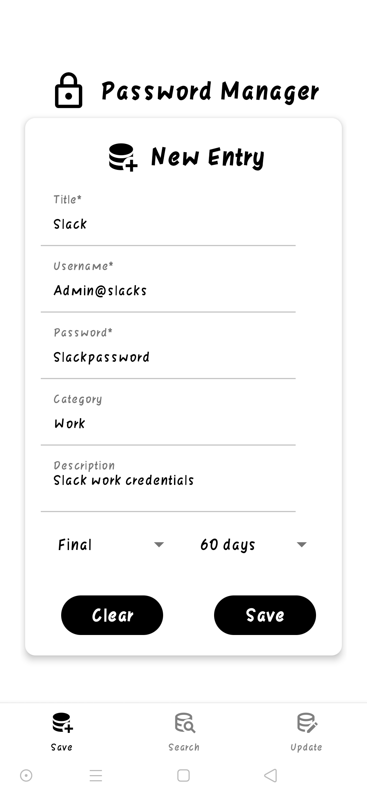
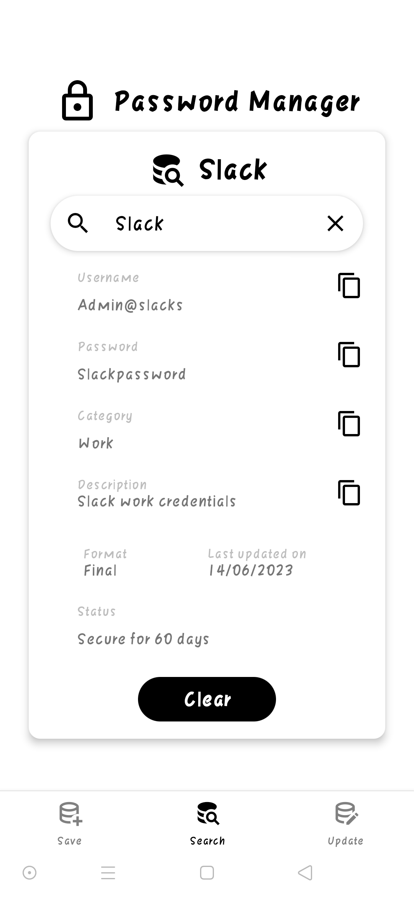
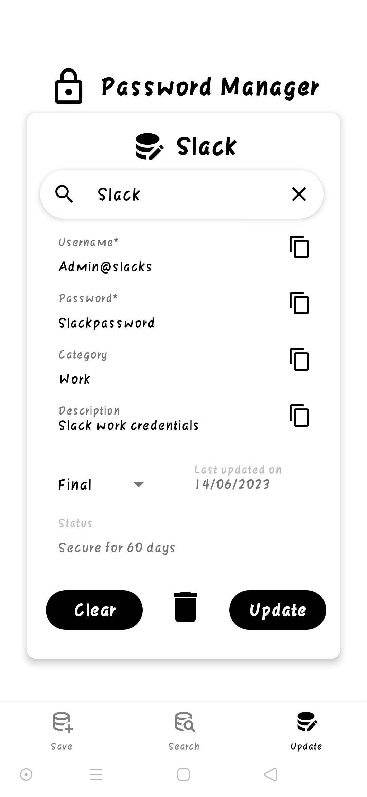
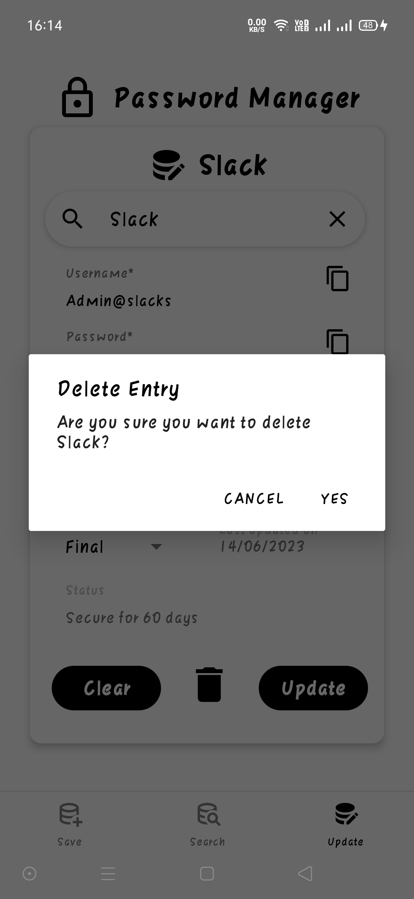

    

<h1 align="center">
    SRpass for Android
</h1> 

<h3 align="center">
<a href="https://youtu.be/O2BMTajYNWo">See Video demo</a>
  </h3>
SRpass is a simple password manager application developed using expo cli and react-native framework. It uses appscript api to store, retrieve and edit the passwords. This application is built only for android devices and is device specific. The Password Manager is a secure and convenient Android app for managing passwords. It allows you to save, search, update, and delete passwords for your various accounts. 

## Features
* Save and store passwords for your accounts.
* Search for passwords to quickly retrieve them.
* Update passwords when you change them.
* Delete passwords you no longer need.
* Copy passwords to the clipboard for easy use.
* Lock the app using the built-in security features of your device.
* Simple and intuitive user interface for easy password management.

## Screenshots
&nbsp;&nbsp;&nbsp;&nbsp;
 
&nbsp;&nbsp;&nbsp;&nbsp;

Versions used are listed in the package.json. The versions and source of the dependencies can be found in package-lock.json.
## License
This project is licensed under the MIT License. Feel free to modify and distribute the app as per the terms of the license.
